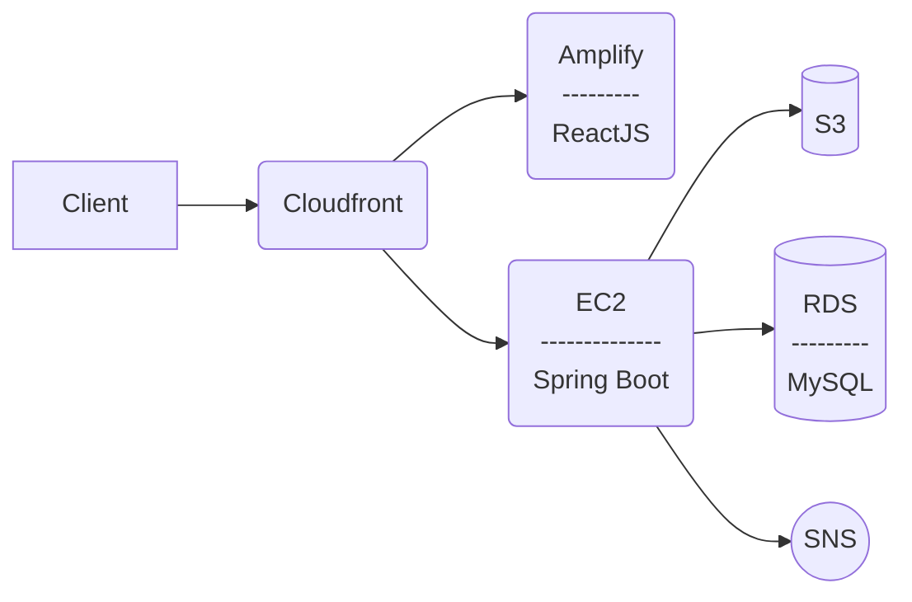

# Gainz Tracker
Gainz Tracker is a web app for tracking workout progress in weight lifting. The first version of GT was created in 2018 using php,
but what can be seen here is the much improved version 2.0. 
## Technical details
This project contains a REST API built on Spring Boot, and a single page frontend web built on React JS. 

It is currently hosted on AWS with automated CD/CI procedures 

